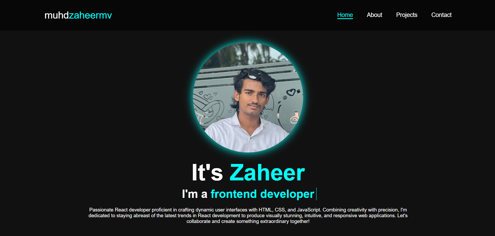

# 💼 Personal Portfolio Website

This is my **personal portfolio website** created using **HTML**, **CSS**, and **JavaScript**. It’s designed to showcase my skills, projects, and contact information in a clean and professional format. Fully responsive and ideal for job applications or freelance clients.

## 🚀 Live Demo

👉 [Live App](https://personal-portfolio-gules-theta.vercel.app/)

## 🛠️ Tech Stack

- **HTML5**
- **CSS3**
- **Vanilla JavaScript**

## ✨ Features

- Fully responsive design
- Project showcase section
- About, Skills, and Contact sections
- Smooth scrolling
- Email contact link and social media icons

## 📚 Ideal For

- Web Developer Portfolio
- Showcasing front-end skills
- Personal branding
- Resume website

## 📫 Contact Me

- **📧 Email:** muhdzaheermv@gmail.com  
- **🔗 Portfolio:** [https://portfolio-lilac-eight-60.vercel.app/](https://portfolio-lilac-eight-60.vercel.app/)  
- **💼 LinkedIn:** [https://www.linkedin.com/in/muhammed-zaheer-836132244/](https://www.linkedin.com/in/muhammed-zaheer-836132244/)

## ⭐ Like This Project?

If you appreciate the design or want to use it as inspiration, please **⭐ star** the repo — it helps and encourages future creative builds!

